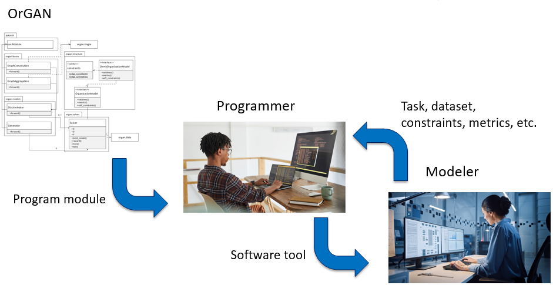
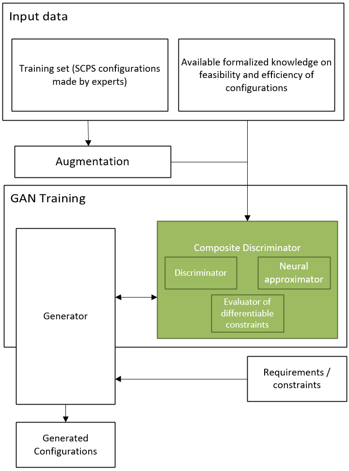

[](https://sai.itmo.ru/)
[](https://en.itmo.ru/en/)

[](https://organ.readthedocs.io/ru/latest/)
[](/LICENSE)
[](/README.md)

# OrGAN

While cyber-physical systems integrate physical resources with IT resources, 
socio-cyber-physical systems integrate physical, cyber- and social "worlds" 
based on real-time interaction between them. 
Their configuration is complicated by the diversity of relations affecting 
each other, the presence of numerous functional dependencies, and by the 
human factor, which can be characterized by fuzziness and the emergence of 
social connections. 
It is not possible to solve this problem using only analytical approaches 
(focused on the processing of hard and fuzzy constraints) 
due to the high diversity of relationships, 
and using only AI models trained on the basis of experts’ experience due 
to the low efficiency of learning functional dependencies based on samples. 
Thus, for their effective configuration, it is necessary to ensure 
(a) their representation, which takes into account the diversity of links 
and the complexity of their topology, 
and (b) the consideration of factors of different mathematical nature, 
namely the experience of experts and hard constraints imposed on various 
parameters, described in the form of equations or table functions. 

OrGAN is aimed at generative design of such systems. 
It considers socio-cyberphysical systems represented in the form of graphs 
and implements a composite discriminator, which is used for training a 
neural network training aimed at generative design of such systems and 
takes into account the mentioned factors. 

OrGAN is not directly aimed at support of modelers or engineers who 
design socio-cyber-physical systems, but to programmers who can use it 
to develop software tools for modelers or engineers.



From the technical point of view, OrGAN implements a procedure of training 
a generative adversarial neural network model for generation of 
socio-organizational structures with complex relation topology. 
It takes into account tacit expert knowledge based on the training 
dataset and parametric dependencies based on both the training dataset 
and programmed functional dependencies. 

For demonstration purposes, an illustrative demo is included.

## The overall scheme of the library


orGAN includes three evaluators of the generated artefacts, namely,
(a) classic discriminator aimed at incorporating expert knowledge from 
the training samples; (b) neural approaximator of non-differentiable constraints, 
and (c) analytical evaluator of differentiable constraints.

## Dependencies

* **python >= 3.9**
* **pytorch >= 1.8**: https://pytorch.org
* **numpy >= 1.19**

For more detailed list of requirements, see `requirements.txt`.


## Usage

To train a generative-adversarial neural network model, two interfaces are provided: 
a command line interface and an application programming interface. The command line 
interface may be useful to a user who is satisfied with the basic architectures 
of neural networks (generator and discriminator), the application programming 
interface provides richer options for configuring a generative-adversarial model.

### Command line interface
To train a generative-adversarial neural network model via the command line
one can use the `main.py` file: 

```
python main.py --rules=module.CustomOrgStructureModelClass
``` 

As the rules argument, the script should be passed a class name 
containing a description of the organizational structure model 
(defining a function for determining the validity of the structure, metrics, etc.) 
that implements the `organ.structure.models.OrganizationModel` interface. 
In addition, as arguments, one can parameterize the neural network models used 
(by choosing the number and dimension of layers), influence the objective 
function used, etc. The full list of supported arguments can be found by 
running the script with the `--help` argument:

```
python main.py --help
```

### API interface

To train the model from the application code, one needs to prepare a structure with 
configuration parameters, construct an instance of the `organ.solver.Solver` class, 
and start training (the `train()` method):

```
from organ.solver import Solver
from organ.demo import LogisticsDepartmentModel
from organ.config import make_config

config = make_config(rules=DemoOrganizationStructureModel(),
                     data_dir='data',
                     model_save_dir='output/models')

solver = organ.solver.Solver(config)
solver.train()
```

## Usage Example

A logistics department can be considered as an example of socio-cyber-physical system.


Each subdepartment is characterized by two parameters: conditional workload 
(auxiliary parameter) and number of personnel.

In addition to information links between departments (represented in the above figure 
by lines), there are hierarchical links (represented by nesting of subdepartments) and 
functional ones. Functional relationships are generally fuzzy (for example, it is 
impossible to unambiguously determine the required number of personnel), however, 
there are constraints that allow assessing the feasibility of a specific set of 
parameters and the presence/absence of certain subdepartments.

The task is to to train a generative-adversarial model that allows generating 
valid logistics department configurations according to the given criteria for a 
given set of input parameters (load of certain departments).

The initial data for solving the problem are represented by two types of information:
* Traning set. Consits of 20 samples placed in the `demo_data/logistics` directory.
* Constraints that allow assessing the feasibilioty of a specific set of 
parameters and the presence/absence of certain subdepartments. These constraints
are represented by the `organ.demo.LogisticsDepartmentModel` class.

The first step in solving the problem is training a generative neural network model 
for the specified class. To do this, one can use either the `main.py` script, 
passing it the appropriate parameters, or directly through the `organ.solver.Solver`
class API. Let's consider the first way. 

To train the generative model, the following steps are to be performed.

In addition to defining constraints that allow to evaluate the feasibility of a specific 
configuration (`organ.demo.LogisticsDepartmentModel` class) one has to 
to use augmentations. To do this, it is needed need to create an augmented dataset using
the training set augmentation algorithm: 

```
python augment_dataset.py demo_logistics 1000 demo_data/logistics data 
```

This will use the training set from the data directory and the validation rules 
described in the `organ.demo.LogisticsDepartmentModel` class. 
During operation, the script will periodically output to the standard output stream 
information about the values of the loss function and the quality metrics of the 
generated configurations.

After training is complete (by default, 200000 iterations), the trained models can be 
used to generate configurations using the following code:
```
import organ.solver

from organ.demo import LogisticsDepartmentModel
from organ.config import make_config

config = make_config(rules=DemoOrganizationStructureModel(),
                     test_iters=100000,
                     data_dir='data',
                     model_save_dir='output/models')

solver = organ.solver.Solver(config)
orgs = solver.generate(32, ctx=[10, 12])
```

Among the specified configuration parameters, the following are the key ones: 
* `test_iters` is the iteration number, the models of which should be used to generate the 
configurations, 
* `model_save_dir` is the directory where the trained models are located. 

As a result, a list of `organ.structure.models.Organization` instances is returned,
each describing one parametrized organization. One can access the description of 
nodes, edges, and parameters via `nodes`, `edges`, and `node_features` attributes
of an `Organization`.

## Documentation

The documentation can be found at: https://organ.readthedocs.io/

To generate documentation you'll need to have Sphinx installed in your machine. After that:

```
cd docs
make html
```

The HTML version of the documentation will appear in the `docs/_build` folder. 


## Testing

The tests are written using PyTest framework. There are two types of tests: unit tests, covering individual
functions and classes and integration tests, covering larger blocks (cooperations of classes, delivering some
complex functionality). These types of tests are distinguished using "marks" mechanism provided by PyTest. To 
run all thetests you can execute:
```
$ pytest
```
from the project root. As integration tests might take some time to complete, sometimes it might be convenient
to run only integration or only unit tests. To run only integration tests:
```
$ pytest -m integration
```
Finally, to run only unit tests:
```
$ pytest -m "not integration"
```

In some cases `pytest` script location is not in the `PATH`, so you
may have to run it via the full path, e.g.:
```
/home/tnn/.local/bin/pytest
```
(for exact path refer to your PyTest installation).


To evaluate test coverage:
```
coverage run -m pytest
coverage report organ/*.py organ/*/*.py
```

### Supported by
The study is supported by the [Research Center Strong Artificial Intelligence in Industry](https://sai.itmo.ru/) 
of [ITMO University](https://en.itmo.ru/) as part of the plan of the center's program: Development and testing of an experimental prototype of a library of strong AI algorithms in terms of generative design of physical and/or digital objects (components of cyberphysical/socio-cyberphysical systems) characterized by a set of interrelated parameters and satisfying the specified requirements.

### Developers

* Andrey Ponomarev
* Nikolay Shilov
* Nikolay Teslya


Contact e-mail: nick@iias.spb.su

### Acknowledgement

OrGAN is based on some ideas from the MolGAN: An implicit generative model for small molecular graphs (https://arxiv.org/abs/1805.11973). However, unlike MolGAN, it is aimed for a different purpose, deals with parametric constituent and supports generation of parametrized organization structures taking into account input parameters.
* [yongqyu/MolGAN-pytorch](https://github.com/yongqyu/MolGAN-pytorch)
* [nicola-decao/MolGAN](https://github.com/nicola-decao/MolGAN)
