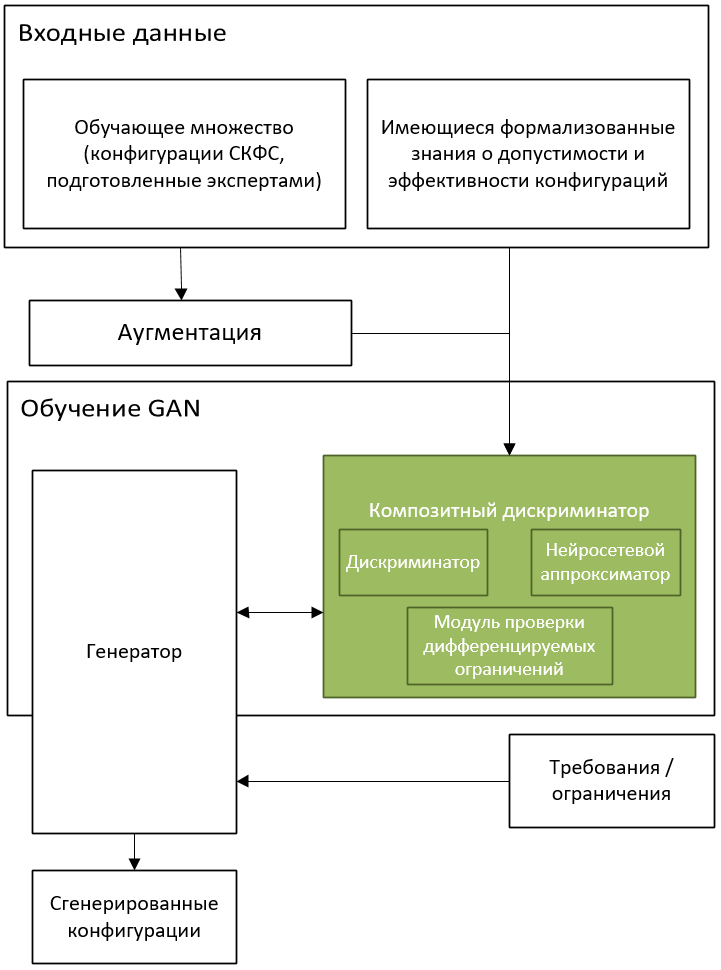
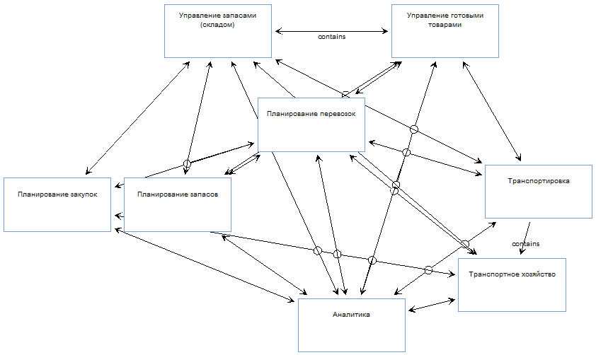

[](https://sai.itmo.ru/)
[](https://en.itmo.ru/en/)

[](https://organ.readthedocs.io/ru/latest/)
[](/LICENSE)
[](/README_en.md)

# OrGAN

В отличие от киберфизических систем, объединяющих физические ресурсы с 
ИТ-ресурсами, социо-киберфизические системы объединяют физические, 
ИТ- и социальные «миры» на основе тесного взаимодействия между этими 
ресурсами в реальном времени.
Конфигурация таких систем осложняется многообразием влияющих друг 
на друга отношений, наличием многочисленных функциональных зависимостей, 
а также присутствием человеческого фактора, который характеризуется 
неопределенностью и возникновением новых социальных связей.
Решить эту задачу невозможно, ни используя только аналитические подходы (ориентированные 
на обработку жестких и нечетких ограничений) из-за большого 
разнообразия связей, ни используя только модели ИИ, обученных на основе 
опыта экспертов, из-за низкой эффективности обучения функциональным зависимостям
на примерах.
Таким образом, для их эффективной конфигурации социо-киберфизических систем
необходимо обеспечить (а) их представление, учитывающее разнообразие связей 
и сложность их топологии, и (б) учет факторов различной математической природы,
а именно опыта экспертов и жестких ограничений, накладываемых на различные 
параметры, описываемые в виде уравнений или табличных функций.

Целью библиотеки OrGAN является генеративный дизайн конфигураций таких систем.
Она рассматривает социо-киберфизические системы, представленные в виде графов, 
и реализует композитный дискриминатор, который используется для обучения 
нейронной сети, направленной на генеративный дизайн таких конфигураций, и 
учитывает указанные факторы.

Библиотека OrGAN не ориентирована непосредственно на поддержку проектировщиков
или инженеров, проектирующих социо-киберфизические системы, а в большей степени
ориентирована на программистов, которые могут использовать ее для разработки 
программных инструментов для вышеупомянутых проектировщиков и инженеров.


С технической точки зрения библиотека OrGAN реализует процедуру обучения 
генеративно-состязательной нейросетевой модели для генерации конфигураций 
социо-организационных структур со сложной топологией связей.
Он учитывает неявные экспертные знания на основе обучающего набора данных 
и параметрические зависимости как на основе обучающего набора данных, так и 
на основе запрограммированных функциональных зависимостей.

В демонстрационных целях в репозиторий включены иллюстративные примеры.

## Общая схема бибилиотеки



Библиотека OrGAN включает три модуля оценки генерируемых артефактов, а именно
(а) "классический" дискриминатор, ориентированный на обучение неявных экспертных
знаний на основе обучающей выборки; 
(б) нейросетевой апроксиматор недифференцируемых ограничений; и 
(в) модуль аналитической оценки дифференцируемых ограничений.

## Зависимости

* **python >=3.9**
* **pytorch >=1.8**: https://pytorch.org
* **numpy >= 1.19**

Более детальный список требований представлен в `requirements.txt`.


## Использование

Для обучения генеративно-состязательной нейросетевой модели предусмотрено 
два интерфейса: интерфейс на основе командной строки и програмный интерфейс (API).

Интерфейс на основе командной строки может быть полезен пользователю, 
которого устраивают базовые архитектуры нейронных сетей 
(генератор и дискриминатор), в то время как программный интерфейс 
предоставляет более богатые возможности для настройки 
генеративно-состязательной модели.

### Интерфейс на основе командной строки
Для обучения генеративно-состязательной модели с использованием командной 
строки используется файл `main.py`: 

```
python main.py --rules=module.CustomOrgStructureModelClass
``` 

В качестве параметра `rules` следуем передать имя класса, соедержащего описание 
модели конфигурируемой организационно-технической системы
(содержащее функцию определения валидности конфигурации, метрики ее оценки и др.) 
и реализующего интерфейс `organ.structure.models.OrganizationModel`. 
Дополнительно, в качестве аргументов можно параметризовать используемую 
нейросетевую модель (выбирая число и размеры слоев), изменять целевую функцию 
и др. Полный списко поддерживаемых параметров можно получить, запустив скрипт
с параметром `--help`: 
```
python main.py --help
```

### Програмный интерфейс

Для обучения модели из кода прикладной программы необходимо подготовить 
структуру с параметрами конфигурации, сконструировать экземпляр класса 
`organ.solver.Solver` и запустить обучение (метод `train()`):

```
from organ.solver import Solver
from organ.demo import LogisticsDepartmentModel
from organ.config import make_config

config = make_config(rules=DemoOrganizationStructureModel(),
                     data_dir='data',
                     model_save_dir='output/models')

solver = organ.solver.Solver(config)
solver.train()
```

## Пример использования

В одном из двух представленых примеров использования в качестве СКФС 
рассматривается логистический отдел компании. При этом под конфигурацией 
подразумевается определенный набор компонентов (подотделов), связей между 
ними и значений числовых параметров для каждого компонента (в данном 
примере – численность персонала).



Каждый подотдел характеризуется двумя параметрами: условная загрузка (служебный
параметр, не определяемый конфигурацией, но используемый для оценки валидности
конфигурации) и количество персонала. 

Кроме информационных связей между подотделами (представлены на рисунке линиями 
без надписей), присутствуют иерархические связи (представлены линии с 
надписью “contains”) и функциональные. Функциональные связи в целом являются 
нечеткими (например, нельзя однозначно определить необходимое количество 
персонала), однако существуют ограничения, позволяющие оценить допустимость 
конкретной совокупности параметров и наличия/отсутствия определенных 
отделов/подотделов. 

Необходимо обучить генеративно-состязательную модель, позволяющую генерировать 
допустимые согласно заданным критериям конфигурации СКФС при заданном 
наборе входных параметров (загрузка определенных подотделов).

Исходные данные для решения задачи представляются двумя видами информации:
* Обучающее множество из 20 образцов (полностью определенные конфигурации с 
соответствующими им входными параметрами - условная загрузка склада 
материалов и склада готовой продукции), которое помещается в каталог data.
* Ограничения, позволяющие оценить допустимость конкретной совокупности 
параметров и наличия/отсутствия определенных отделов/подотделов. 
Данные ограничения представлены классом `organ.demo.LogisticsDepartmentModel`.

Поскольку обучающее множество содержит всего 20 образцов, первым этапом в 
решении задачи является аугментация обучающего множества, для которой 
следует следует использовать скрипт `augment_dataset.py`:

```
python augment_dataset.py demo_logistics 10000 demo_data/logistics data_augmented
```

В результате работы скрипта множество моделей СКФС, расширенное с помощью 
применения предложенного алгоритма аугментации до 10000 образцов, 
будет помещено в каталог `data_augmented`.

Далее необходимо произвести обучение генеративной нейросетевой модели для 
указанного класса компонентов СКФС. Для этого можно воспользоваться либо 
скриптом `main.py`, передав ему соответствующие параметры, либо непосредственно
через программный интерфейс класса `organ.solver.Solver`. Рассмотрим первый 
способ. Для обучения модели с помощью скрипта необходимо выполнить следующую 
команду:

```
python main.py --rules demo_logistics --data_dir data_augmented
```

При этом будет использовано расширенное обучающее множество из каталога 
`data_augmented` и правила проверки, описанные в классе 
`organ.demo.LogisticsDepartmentModel`. В ходе работы скрипт периодически 
будет выводить в стандартный поток вывода информацию о значениях функции 
потерь и метрики качества генерируемых конфигураций компонентов СКФС.
После завершения обучения (по умолчанию, 200000 итераций), обученные 
модели можно использовать для генерации конфигураций логистических 
отделов компонентов СКФС для заданных параметров с помощью следующего кода:

```
from organ.solver import Solver
from organ.config import make_config
from organ.demo import LogisticsDepartmentModel

config = make_config(
    # Класс с описанием правил оценки моделей
    # организационных структур (в данном случае -
    # отдела логистики)
    rules=LogisticsDepartmentModel(),
    # Точка сохранения, из которой следует
    # загрузить модель
    test_iters=60000,
    # Directories.
    data_dir='data_augmented',
    model_save_dir='output/models',
)

# Условия для генерации компонентов СКФС
ctx = np.array([10, 12])

solver = organ.solver.Solver(config)
orgs = solver.generate_valid(32, ctx=ctx)
```

Среди указанных параметров конфигурации и аргументов, передаваемых функции 
генерации, ключевыми являются следующие: `test_iters` – номер итерации, модели 
которой следует использовать для генерации конфигурации компонентов СКФС, 
`model_save_dir` – каталог, в котором находятся обученные модели, 
`ctx` – контекст (входные параметры) для генерации конфигураций 
(условная загрузка склада материалов и склада готовой продукции соответственно). 
Сформированный список структур будет помещен в переменную orgs. 
Каждый элемент этого списка содержит одну сгенерированную конфигурацию 
компонента СКФС (в данном случае – логистического отдела), составляющие 
которой (типы элементов, связей, параметризация элементов) могут быть 
выведены в консоль:

```
print('Подразделения:\n', orgs[0].nodes)
print('Связи:\n', orgs[0].edges)
print('Параметры подразделений:\n', orgs[0].node_features.ravel())

Подразделения:
 [ 0  0  2  3  0  5  6  7  8  9 10  0]
Связи:
 [[0 0 0 0 0 0 0 0 0 0 0 0]
 [0 0 0 0 0 0 0 0 0 0 0 0]
 [0 0 0 0 0 2 0 2 2 2 2 0]
 [0 0 0 0 0 0 2 2 2 2 2 0]
 [0 0 0 0 0 0 0 0 0 0 0 0]
 [0 0 2 0 0 0 0 2 2 0 0 0]
 [0 0 0 2 0 0 0 2 2 0 0 0]
 [0 0 2 2 0 2 2 0 2 0 2 0]
 [0 0 2 2 0 2 2 2 0 0 2 0]
 [0 0 2 2 0 0 0 0 0 0 2 0]
 [0 0 2 2 0 0 0 2 2 2 0 0]
 [0 0 0 0 0 0 0 0 0 0 0 0]]
Параметры подразделений:
 [ 0.         0.        12.69819   15.418587   0.         5.6959157
  6.456403   6.382445   3.7638607  2.0864    25.380123   0.       ]
```

Оценка сгенерированных конфигураций СКФС производится по точности выполнения 
требований, определенных и реализованных в классе модели организационной 
структуры (в данном случае, `organ.demo.LogisticsDepartmentModel`). 
В частности, любой класс модели должен определять два метода `validness()`
и `metrics()`. Первый возвращает логическое значение, соответствующее 
факту допустимости параметризованной структуры, переданной ему в качестве 
аргумента, второй – набор значений метрик, релевантных для данного класса 
моделей. Таким образом, точность выполнения требований может быть оценена 
как отношение числа валидных сгенерированных структур к общему числу 
сгенерированных структур:

```
>>> rules = LogisticsDepartmentModel()
>>> sum([rules.validness(x) for x in orgs]) / len(orgs)
1.0
```

Таким образом, все сгенерированные структуры оказались валидными. Значения 
метрик для первой сгенерированной структуры:

```
>>> rules.metrics(orgs[0]) 
{'node score': True, 'edge score': True, 'staff score': True}
```

В данном случае, значения метрик не являются особенно информативными, 
поскольку в качестве метрик определены выполнение требований к узлам, 
связям, и параметрам соответственно, то есть, у любой валидной структуры 
все три метрики должны принимать истинные значения.

## Документация

Документацию можно увидеть, проследовав по следующей ссылке:
https://organ.readthedocs.io/ru/latest/

Для генерации документации необходимо использовать пакет Sphinx и выполнить
команды:

```
cd docs
make html
```

Документация в формате HTML будет сгенерирована в папке `docs/_build`. 


## Тестирование

В библиотеке OrGAN определено 28 модульных и 1 интеграционный тест. Все тесты 
находятся в каталоге `tests` и реализованы с помощью фреймворка модульного 
тестирования PyTest. Для разделения категорий тестов используется механизм 
меток, поддерживаемый `PyTest`: в файле настроек `PyTest` определена метка
`integration`, и эта метка используется в качестве аннотации для 
интеграционных тестов. 

В каталоге `tests/data` находится тестовый набор данных, используемый для 
проверки функций работы с набором данных, а также для интеграционного теста.

Для запуска модульных тестов необходимо, находясь в корневой директории 
репозитория, выполнить:

```
pytest -m 'not integration'
```

Модульные тесты сгруппированы по тестируемым модулям OrGAN. 

Имя тестового модуля, как правило, образовано от имени тестируемого модуля, 
к которому добавлен префикс `test_` (редкие исключения связаны с ситуациями, 
когда имя тестового модуля слишком длинное или во избежание конфликта, 
когда модуль с одним именем присутствует в разных пакетах). 

В каталоге `tests` также находится модуль `util`, в котором определен ряд 
вспомогательных функций, используемых при тестировании (в частности, для 
проверки общих требований к нейронным сетям – чувствительность к каждому 
из входов, возможность расчета градиента, обучаемость).
 
Об успешности прохождения модульных тестов можно судить по служебному 
выводу утилиты `PyTest`.

Интеграционный тест осуществляет проверку загрузки набора данных, 
обучения модели, расчета метрики и генерации конфигураций компонентов СКФС. 
Данный тест находится в тестовом модуле `test_solver.py` и помечен меткой 
`pytest.mark.integration`, чтобы обеспечить возможность раздельного 
запуска модульных и интеграционных тестов. Для запуска интеграционного 
теста необходимо, находясь в корневой директории репозитория, выполнить:

```
pytest -m 'integration'
```

В рамках этой проверки производится загрузка обучающего набора данных 
(относящегося к демонстрационному примеру), проводится несколько итераций 
обучения, проверяется факт сохранения итоговой (обученной) генеративной 
модели, далее модель загружается и производится вычисление показателей 
качества на тестовом множестве.
 
Об успешности прохождения интеграционых тестов также можно судить по 
служебному выводу утилиты `PyTest`.

### Поддержка

Исследование проводится при поддержке [Исследовательского центра сильного искусственного интеллекта в промышленности](https://sai.itmo.ru/) [Университета ИТМО](https://itmo.ru) в рамках мероприятия программы центра: Разработка и испытания экспериментального образца библиотеки алгоритмов сильного ИИ в части генеративного дизайна физических и/или цифровых объектов (компонентов киберфизических / социо-киберфизических систем), характеризующихся набором взаимосвязанных параметров и удовлетворяющих заданным требованиям.

### Разработчики

* Андрей Пономарев
* Николай Шилов
* Николай Тесля

Контактный e-mail: nick@iias.spb.su

### Благодарности

Библиотека OrGAN основана на некоторых идеях проекта MolGAN: An implicit 
generative model for small molecular graphs 
(https://arxiv.org/abs/1805.11973). 
Однако, в отличие от MolGAN, она преследует иную цель, учитывает 
параметрическую составлющую и поддерживает генерацию параметризованных 
организационных структур, учитывая входные параметры.
* [yongqyu/MolGAN-pytorch](https://github.com/yongqyu/MolGAN-pytorch)
* [nicola-decao/MolGAN](https://github.com/nicola-decao/MolGAN)
